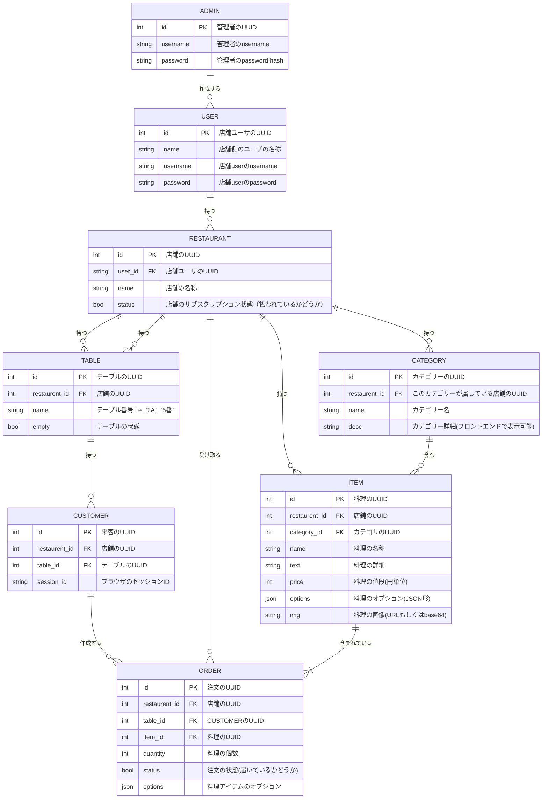

# ER 図

```mermaid
erDiagram

    ADMIN {
        int id PK "管理者のUUID"
        string username "管理者のusername"
        string password "管理者のpassword hash"
    }

    USER {
        int id PK "店舗ユーザのUUID"
        string name "店舗側のユーザの名称"
        string username "店舗userのusername"
        string password "店舗userのpassword"
    }

    RESTAURANT {
        int id PK "店舗のUUID"
        string user_id FK "店舗ユーザのUUID"
        string name "店舗の名称"
        bool status "店舗のサブスクリプション状態（払われているかどうか）"
    }

    TABLE {
        int id PK "テーブルのUUID"
        int restaurent_id FK "店舗のUUID"
        string name "テーブル番号 i.e. `2A`, `5番`"
        bool empty "テーブルの状態"
    }

    CATEGORY {
        int id PK "カテゴリーのUUID"
        int restaurent_id FK "このカテゴリーが属している店舗のUUID"
        string name "カテゴリー名"
        string desc "カテゴリー詳細(フロントエンドで表示可能)"
    }

    ITEM {
        int id PK "料理のUUID"
        int restaurent_id FK "店舗のUUID"
        int category_id FK "カテゴリのUUID"
        string name "料理の名称"
        string text "料理の詳細"
        int price "料理の値段(円単位)"
        json options "料理のオプション(JSON形)"
        string img "料理の画像(URLもしくはbase64)"
    }

    ORDER {
        int id PK "注文のUUID"
        int restaurent_id FK "店舗のUUID"
        int table_id FK "CUSTOMERのUUID"
        int item_id FK "料理のUUID"
        int quantity "料理の個数"
        bool status "注文の状態(届いているかどうか)"
        json options "料理アイテムのオプション"
    }

    CUSTOMER {
        int id PK "来客のUUID"
        int restaurent_id FK "店舗のUUID"
        int table_id FK "テーブルのUUID"
        string session_id "ブラウザのセッションID"
    }

    ADMIN ||--o{ USER : "作成する"
    USER ||--o{ RESTAURANT : "持つ"
    CUSTOMER ||--o{ ORDER : "作成する"
    RESTAURANT ||--o{ TABLE : "持つ"
    RESTAURANT ||--o{ ORDER : "受け取る"
    RESTAURANT ||--o{ ITEM : "持つ"
    RESTAURANT ||--o{ TABLE : "持つ"
    RESTAURANT ||--o{ CATEGORY : "持つ"
    CATEGORY ||--o{ ITEM : "含む"
    ITEM ||--|{ ORDER : "含まれている"
    TABLE ||--o{ CUSTOMER: "持つ"
```
